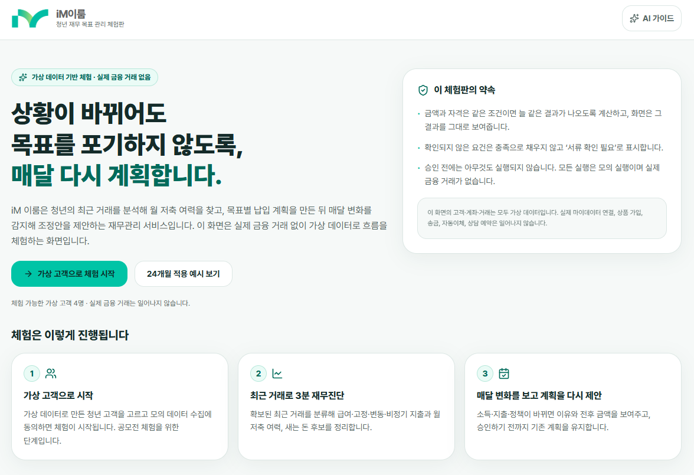
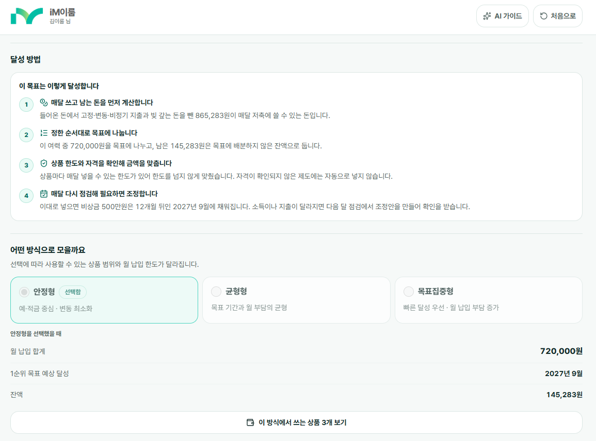

# iM 이룸

> 상황이 바뀌어도 목표를 포기하지 않도록, 매달 다시 계획합니다.

청년의 최근 거래를 분석해 월 저축 여력을 찾고, 목표별 납입 계획을 만든 뒤 매달 달라진 상황에 맞는 조정안을 제안하는 **재무 목표 관리 웹앱 프로토타입**입니다.

**iM뱅크 AI BlockChain Challenge in Daegu 출품 프로젝트**로, 실제 마이데이터·은행 계정계·송금·상품 가입은 연결하지 않습니다. 모든 고객과 거래는 합성 데이터이며 실행 결과도 모의 기록입니다.

## 서비스 미리보기

### 1. 가상 고객으로 시작하는 재무관리 체험

소개 화면에서 서비스 목적과 체험 범위를 확인하고, **가상 고객으로 체험 시작** 또는 **24개월 적용 예시 보기**를 선택합니다. 모의 수집 동의 후 최근 거래를 진단하고 월간 변화에 따른 계획 조정을 경험할 수 있습니다.



### 2. 목표를 이루는 방법을 이해하고 선택

목표 관리 화면은 **저축 여력 계산 → 우선순위별 배분 → 상품 한도·자격 확인 → 월간 재점검** 순서로 계획의 근거를 설명합니다.

안정형·균형형·목표집중형을 비교하고, 선택한 방식의 **월 납입 합계·예상 달성 시점·배분하지 않은 잔액**과 후보 상품을 확인할 수 있습니다. 화면의 금액과 날짜는 선택한 합성 고객과 계획에 따른 예시이며 실제 수익이나 달성을 보장하지 않습니다.



## 핵심 사용자 흐름

1. **고객 선택·모의 동의:** 합성 고객을 선택하고 데이터 수집에 동의합니다.
2. **최근 거래 진단:** 급여·고정·변동·비정기 지출을 살펴 저축 여력과 새는 돈 후보를 확인합니다.
3. **목표 설계:** 목표 금액·기간·우선순위와 저축 방식을 정합니다.
4. **월간 점검:** 동의일 기준 월 1회 수집을 가정한 시나리오에서 재무 상태와 외부 조건의 변화를 비교합니다.
5. **조정안 확인:** 변경 이유와 계획 전후를 비교하고 승인하거나 거절합니다.
6. **모의 실행:** 승인한 계획만 모의 실행하며, 위험 사례는 상담 흐름으로 연결합니다.

금액·기간·자격·배분은 규칙 엔진이 계산합니다. 생성형 AI는 계산 결과 설명, 제한형 상담, 검수 전 정책 요건 구조화 초안을 담당합니다.

## 현재 구현 범위

- 서비스 소개, 청년용 재무 홈, 목표 관리, 월간 계획 비교
- 합성 거래 기반 재무 계산 및 목표별 자금 배분
- 정책 자격 상태 구분과 정책 변경 시나리오
- 소득 변화 감지와 위험 사례의 상담사 대시보드 연결
- 사용자 승인 후 모의 실행 기록
- Claude API 기반 결과 설명·제한형 상담·정책 요건 구조화 초안과 장애 시 대체 설명
- 고객 페르소나 3종과 페르소나별 전체 시연 흐름

상태는 현재 브라우저 메모리에만 저장됩니다. 새로고침 이후에도 계획·승인·실행 기록을 유지하는 영속 저장소는 아직 구현되지 않았습니다. 상세 현황은 [개발 현황](docs/DEVELOPMENT_STATUS.md)을 참고하세요.

## 실행

Node.js 22.12 이상(권장: Node.js 24 LTS)과 npm이 필요합니다. 최초 npm ci 설치에는 인터넷이 필요하며, 설치 후 기본 체험은 API 키 없이 동작합니다.

```bash
npm ci
 # 기본 체험은 .env 생성 없이 실행합니다.
npm run dev
```

`.env`의 API 키는 모두 선택 사항입니다. 키가 없거나 호출이 실패하면 계산 결과를 사용한 정형 설명으로 동작합니다.

검증 명령:

```bash
npm run data:validate
npm run ai:validate
npm run lint
npm run build
npm start
```

## AI 설명 실행 모드

AI는 금액을 계산하지 않습니다. 계산은 규칙 엔진이 하고, AI는 그 결과를 문장으로 옮기는 역할만 합니다. 서버(`/api/ai/*`)에서만 외부 모델을 호출하며 브라우저는 API 키를 알지 못합니다.

| `AI_MODE` | `ANTHROPIC_API_KEY` | 동작 | 화면 표시 |
|---|---|---|---|
| `fixture` (기본값) | 없어도 됨 | 준비된 AI 응답 사용 | 미리 준비된 AI 설명 |
| `live` | 있음 | Claude API 호출 | Claude가 생성한 설명 |
| `live` | 없음 | 준비된 AI 응답으로 자동 전환 | 미리 준비된 AI 설명 |
| 무엇이든 | 호출 실패·시간 초과·형식 오류 | 준비된 응답 → 규칙 기반 설명 | 미리 준비된 AI 설명 / 규칙 기반 설명 |

```bash
# 1) 키 없이 전체 기능 실행 (기본값, 제출 ZIP 기준)
npm run dev

# 2) 준비된 AI 응답을 명시적으로 사용
AI_MODE=fixture npm run dev

# 3) 실제 Claude 호출 (.env에 키를 두고 실행)
#    ANTHROPIC_API_KEY=sk-ant-...
#    ANTHROPIC_MODEL=claude-sonnet-4-6
#    AI_MODE=live
npm run dev

# 현재 동작 모드 확인 (키 값은 반환하지 않음)
curl http://localhost:3000/api/ai/health
```

Windows PowerShell에서는 `$env:AI_MODE="fixture"; npm run dev` 형태로 실행합니다.

API 키는 저장소, 프론트엔드 번들, 제출 ZIP, 로그에 넣지 않습니다. 배포 환경에서는 `ANTHROPIC_API_KEY`, `ANTHROPIC_MODEL`, `AI_MODE`를 서버 측 환경변수로만 추가합니다. 자세한 계약과 대체 경로는 [TRD 4장](docs/TRD.md)을 참고하세요.

## 기준 데이터와 오프라인 mock

온통청년 정책 API와 금융감독원 금융상품 한눈에 API는 개발 중 기준 데이터 갱신에만 사용합니다. 브라우저는 API 키나 외부 API를 직접 호출하지 않으며, ZIP 제출본은 `frontend/src/fixtures/generated/referenceCatalog.ts`에 포함된 합성 데이터만 읽습니다.

```bash
# data/mock/raw을 정규화해 오프라인 fixture 재생성
npm run data:mock
npm run data:validate

# 선택 작업: .env에 키가 있을 때 실제 응답을 gitignore된 data/raw에 수집
npm run data:sync
```

실제 응답은 자동으로 mock에 승격하지 않습니다. 필드와 이용조건을 검토하고 개인정보·인증정보가 없음을 확인한 뒤 `data/mock/raw`에 합성 레코드로 반영합니다.

브랜치는 `main`을 안정본, `dev`를 기능 통합본으로 사용합니다. 기능 브랜치는 `dev`에서 만들고 검증 후 `dev`로 합친 다음, 배포 가능한 시점에 `main`으로 병합합니다.

## 프로젝트 구조

```text
frontend/src/       React 화면, 클라이언트 상태, 합성 시나리오
backend/            Express API, 외부 모델 프록시, 향후 수집·저장 작업
backend/ai/         Claude 호출, 비식별 처리, Schema 검증, 대체 경로
api/ai/             AI 라우트 핸들러 (Express와 서버리스 환경 공용)
data/mock/raw/      공개 API 응답 구조를 재현한 합성 원본
data/mock/ai/       준비된 AI 설명·상담 답변·정책 구조화 초안
scripts/data/       수집·정규화·fixture 생성·검증 명령
docs/               PRD, TRD, 디자인 및 개발 현황
```

프론트엔드는 외부 API 키를 읽지 않습니다. 백엔드는 비밀키와 외부 호출을 담당하며, ZIP 제출 환경에서는 프론트엔드에 번들된 합성 fixture만으로 핵심 시연이 동작합니다.

## 화면 모드

- 고객 모드: 재무 상태, 목표, 이번 달 변경안, 지원제도 확인
- 상담사 모드: 위험 사례와 상담 브리핑 확인
- 데모 도구: 공모전 시연을 위한 월 이동 및 합성 시나리오 주입

일반 접속은 고객용 재무 홈으로 시작합니다. `?demo=true`에서는 소개 화면과 시나리오 도구를 함께 사용할 수 있습니다.

## 문서

- [PRD](docs/PRD.md)
- [TRD](docs/TRD.md)
- [IDEATION](docs/IDEATION.md)
- [UI 디자인 기준](docs/DESIGN.md)
- [개발 에이전트 지침](AGENTS.md)
- [개발 현황](docs/DEVELOPMENT_STATUS.md)
- [팀 역할과 작업 프롬프트](docs/TEAM_WORKFLOW.md)
- [브랜치·PR 운영](docs/BRANCHING.md)

AI Studio 원본: https://ai.studio/apps/56ac0402-8da0-4ab0-8621-7541387fa500
