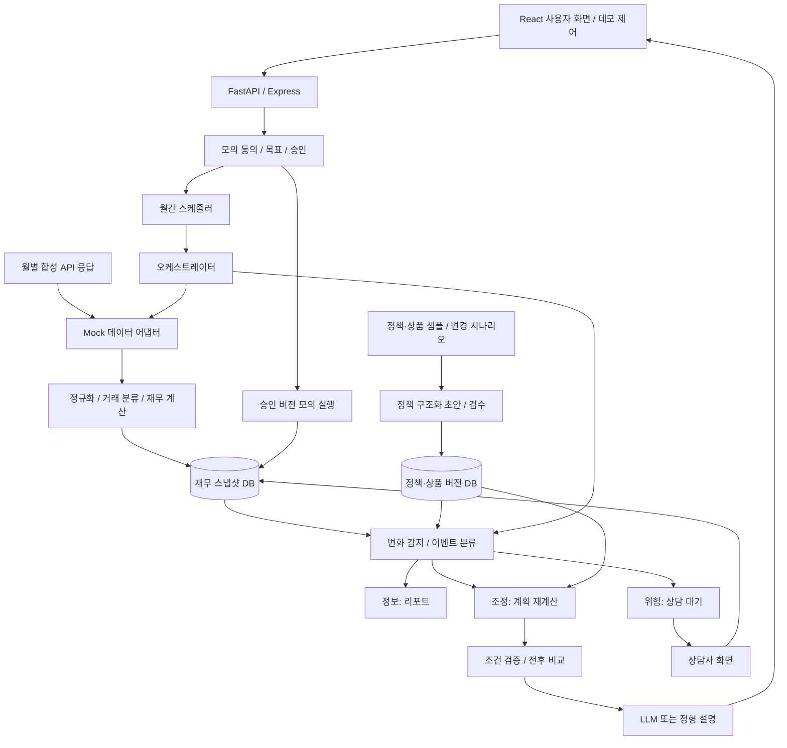
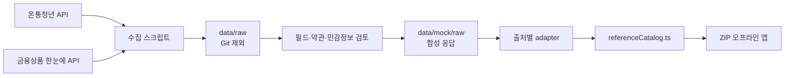
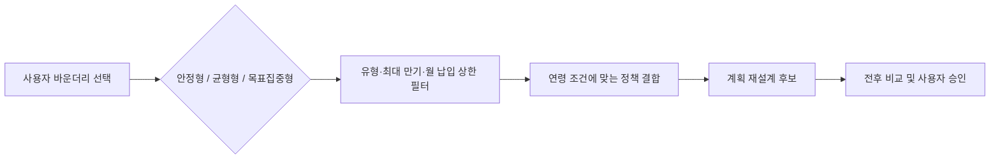

# iM 이룸 — TRD

버전: 0.1 · 작성일: 2026-09-19 · 상태: 구현 제안

제품 범위는 [PRD.md](PRD.md)를 따른다. 아래 API·스키마는 **프로젝트 내부 계약 초안**이며 공식 마이데이터 표준 명세가 아니다. 외부 API의 실제 필드·권한·제공 범위는 아직 검증하지 않았다.

## 1. 아키텍처

오케스트레이터는 작업 순서·실행 상태·재시도·중복 방지·분기를 관리하는 백엔드 구성요소이다. LLM 에이전트가 임의로 도구를 선택하거나 금융 실행을 결정하는 구조로 만들지 않는다. 정책·상품 DB와 고객 스냅샷은 독립적으로 갱신하고 판단 단계에서 결합한다.

## 2. 기술 선택

| 계층 | 제안 | 적용 범위 |
|---|---|---|
| 프론트엔드 | React + TypeScript | 사용자·상담사·데모 화면 |
| 서버 | Node.js + Express / TypeScript | 데이터 계약, 상태 전이, 계산 API, Gemini 프록시 |
| 저장소 | 클라이언트/서버 인메모리 + LocalStorage 영속화 | 스냅샷·버전·계획·이벤트·실행 이력 |
| 최적화 | 우선순위 기반 결정적 배분 | 제약조건을 명시적으로 검증 |
| 거래 분류 | 규칙 기반 정규화 | ML 미구현 상태를 AI 학습 모델로 표기하지 않음 |
| 생성형 AI | Gemini API / 정형 설명 Fallback | 설명 생성 및 질의응답 보조 |

### 2.0 코드 경계

| 영역 | 경로 | 책임 |
|---|---|---|
| Frontend | `frontend/src` | React UI, 사용자 입력, 데모 세션 상태, 오프라인 fixture 표시 |
| Backend | `backend` | `/api` 라우트, 비밀키, Gemini 호출, 향후 스케줄·영속 저장 |
| Data pipeline | `scripts/data`, `data` | 외부 기준 데이터 수집, 정규화, 합성 fixture 생성 |

프론트엔드는 `GEMINI_API_KEY`, 온통청년 키, 금융상품 한눈에 키에 접근하지 않는다. 금융 실행을 의미하는 상태 변경은 향후 백엔드 명령 API로 이동하며, 현재 클라이언트 구현은 모의 실행임을 유지한다.

### 2.1 정책·상품 기준 데이터 파이프라인

- API 키는 서버측 수집 스크립트에서만 읽으며 URL·로그·fixture에 저장하지 않는다.
- 원본 응답은 `data/raw`에 임시 저장하고 Git에서 제외한다.
- `data/mock/raw`은 공개 API의 필드 구조만 재현한 합성 데이터이다.
- 앱은 생성된 catalog만 import하므로 외부 API 장애와 네트워크 차단에도 동작한다.
- 갱신 과정은 `data:sync` → 사람 검토 및 합성 → `data:mock` → `data:validate` 순서다.

### 2.2 사용자 상품 바운더리

사용자는 계획 생성 전에 상품 탐색 범위를 선택한다. 이 선택은 투자 성향 진단이 아니라 예·적금의 유동성, 만기, 월 납입 부담을 제한하는 입력값이다.

정책 mock은 연령 조건이 다른 10건, 상품 mock은 정기예금 10건과 적금 10건을 유지한다. `selectProductsByBoundary`가 사용자 선택을 결정적 규칙으로 적용하며 AI가 허용 범위를 임의로 넓히지 않는다.

## 3. 합성 데이터 계약 및 핵심 모델

- 시나리오 ID (S01~S09)
- DemoCustomer: scenario_id, name, age, residence, is_synthetic: true
- Consent: status, consented_at, revoked_at, anchor_day: 15
- FinancialSnapshot: as_of, monthly_income, fixed_expenses, variable_budget, debt_payment, available_surplus, emergency_fund, accounts, transactions
- Goal: id, title, target_amount, current_amount, target_months, priority
- AllocationPlan: version, items: [{goal_id, product_id, monthly_amount, expected_completion}], assumptions, status (DRAFT/PROPOSED/APPROVED/REJECTED/MOCK_EXECUTED)
- ChangeEvent: type (INFO/ADJUSTMENT/RISK), severity, message, evidence, old_value, new_value
- ConsultationCase: id, risk_event_id, customer_name, risk_type, briefing, status (WAITING/IN_PROGRESS/COMPLETED)
- MockExecution: id, plan_version, idempotency_key, executed_at, status
