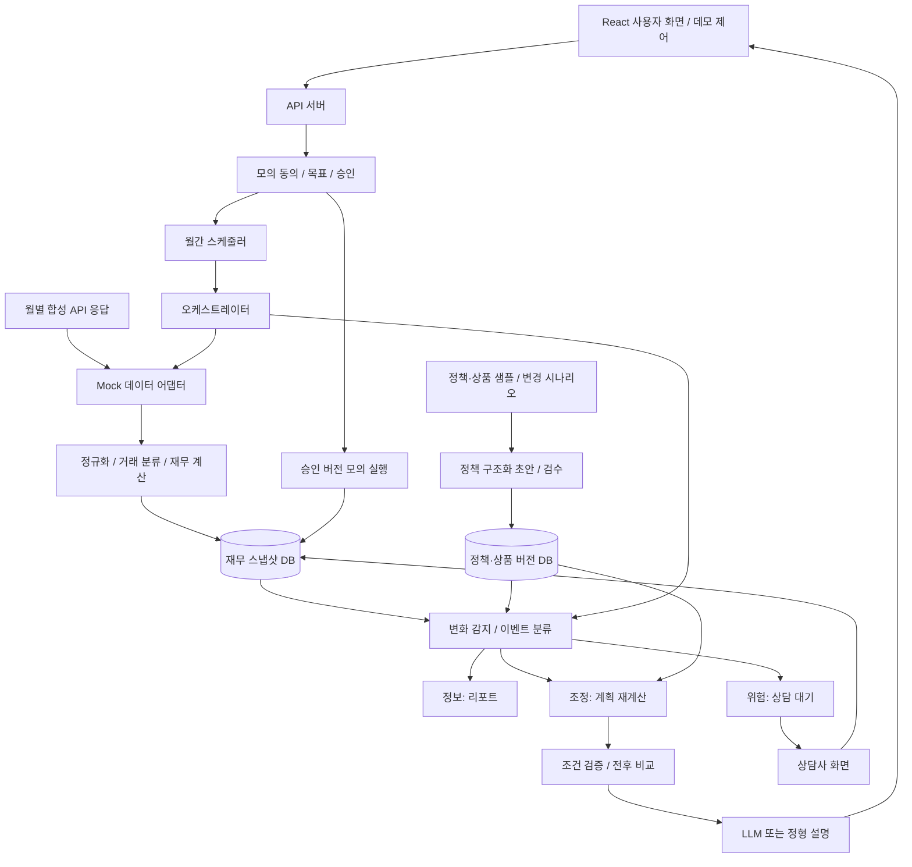
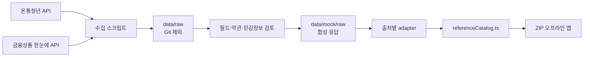
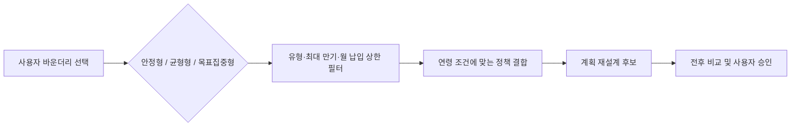

# iM 이룸 — TRD

버전: 0.3 · 갱신일: 2026-09-20 · 상태: Mock API v1 계약 확정

제품 범위는 [PRD.md](PRD.md)를 따른다. 아래 API·스키마는 **프로젝트 내부 계약 초안**이며 공식 마이데이터 표준 명세가 아니다. 외부 API의 실제 필드·권한·제공 범위는 아직 검증하지 않았다.

## 1. 아키텍처



오케스트레이터는 작업 순서·실행 상태·재시도·중복 방지·분기를 관리하는 백엔드 구성요소이다. LLM 에이전트가 임의로 도구를 선택하거나 금융 실행을 결정하는 구조로 만들지 않는다. 정책·상품 DB와 고객 스냅샷은 독립적으로 갱신하고 판단 단계에서 결합한다.

## 2. 기술 선택

최종기획서의 목표 기술과 현재 공모전 프로토타입 구현을 구분한다. 목표 기술을 이미 구현한 것으로 표시하지 않는다.

### 2.1 목표 아키텍처

| 계층 | 최종기획서 기술 | 목표 용도 |
|---|---|---|
| 프론트엔드 | React | 사용자 화면, 상담사 대시보드 |
| 백엔드 | Python, FastAPI | 감지·재설계 엔진, API 서버 |
| 워크플로 | Apache Airflow | 정책·금리·시세 일간 수집과 비교 |
| 저장·검색 | PostgreSQL, pgvector | 재무 시계열, 정책 버전, 공식 문서 검색 |
| 최적화 | Google OR-Tools | 상품 한도·비상자금 등 제약 기반 배분 |
| 생성형 AI | Claude API | 정책 요건 구조화, 설명, 상담 답변 |
| 머신러닝 | scikit-learn, LightGBM | 거래 분류 모델, 재무진단 |

### 2.2 현재 프로토타입

| 계층 | 제안 | 적용 범위 |
|---|---|---|
| 프론트엔드 | React + TypeScript | 사용자·상담사·데모 화면 |
| 서버 | Node.js + Express / TypeScript | 데이터 계약, 상태 전이, 계산 API, Gemini 프록시 |
| 저장소 | 클라이언트/서버 인메모리 | 스냅샷·버전·계획·이벤트·실행 이력 데모 |
| 최적화 | 우선순위 기반 결정적 배분 | 제약조건을 명시적으로 검증 |
| 거래 분류 | 규칙 기반 정규화 | ML 미구현 상태를 AI 학습 모델로 표기하지 않음 |
| 생성형 AI | Claude API (`/api/ai/*`) · 준비된 응답 · 정형 설명 Fallback | 설명 생성, 제한형 상담, 정책 구조화 초안 (4장) |

### 2.3 코드 경계

| 영역 | 경로 | 책임 |
|---|---|---|
| Frontend | `frontend/src` | React UI, 사용자 입력, 데모 세션 상태, 오프라인 fixture 표시 |
| Backend | `backend` | `/api` 라우트, 비밀키, 외부 모델 호출, 향후 스케줄·영속 저장 |
| AI 라우트 | `api/ai`, `backend/ai` | Claude 호출, 비식별 처리, Schema 검증, 대체 경로 (4장) |
| Data pipeline | `scripts/data`, `data` | 외부 기준 데이터 수집, 정규화, 합성 fixture 생성 |

`api/ai/*.ts`의 핸들러는 `(req, res)` 형태라서 현재 Express 라우터(`backend/ai/router.ts`)와 Vercel Function 같은 다른 서버 실행 환경에서 같은 코드로 동작한다. 브라우저는 어느 경우에도 `/api/ai/*`만 호출한다.

프론트엔드는 `ANTHROPIC_API_KEY`, `GEMINI_API_KEY`, 온통청년 키, 금융상품 한눈에 키에 접근하지 않는다. 금융 실행을 의미하는 상태 변경은 향후 백엔드 명령 API로 이동하며, 현재 클라이언트 구현은 모의 실행임을 유지한다.

### 2.4 정책·상품 기준 데이터 파이프라인



- API 키는 서버측 수집 스크립트에서만 읽으며 URL·로그·fixture에 저장하지 않는다.
- 원본 응답은 `data/raw`에 임시 저장하고 Git에서 제외한다.
- `data/mock/raw`은 공개 API의 필드 구조만 재현한 합성 데이터이다.
- 앱은 생성된 catalog만 import하므로 외부 API 장애와 네트워크 차단에도 동작한다.
- 갱신 과정은 `data:sync` → 사람 검토 및 합성 → `data:mock` → `data:validate` 순서다.
- 고객 재무 데이터는 동의 기준일에 월 1회 갱신하고, 정책·상품 기준 데이터는 별도 일간 비교 대상으로 설계한다.

### 2.5 사용자 상품 바운더리

사용자는 계획 생성 전에 상품 탐색 범위를 선택한다. 이 선택은 투자 성향 진단이 아니라 예·적금의 유동성, 만기, 월 납입 부담을 제한하는 입력값이다.



정책 mock은 연령 조건이 다른 10건, 상품 mock은 정기예금 10건과 적금 10건을 유지한다. `selectProductsByBoundary`가 사용자 선택을 결정적 규칙으로 적용하며 AI가 허용 범위를 임의로 넓히지 않는다.

## 3. 합성 데이터 계약 및 핵심 모델 (Mock API v1)

계약 버전 `mock-api-v1`, 규칙 버전 `RULE_2026_09_V2`, 데이터셋 버전 `synthetic-2026-09-20.v1`. 타입 원본은 `frontend/src/data/apiContracts.ts`, 예시 응답은 `data/mock/api/*.json`(생성 파일)이다. Frontend는 응답을 그대로 표시하고 금액·자격·판정을 다시 계산하지 않는다.

### 3.1 공통 원칙

- 금액은 KRW 정수. 월 납입액은 만원 단위 내림, 월평균은 원 단위 반올림(`Math.round`).
- 모르는 값은 `null`이다. 0으로 채우지 않는다. `null`이 섞인 계산 결과도 `null`이다.
- 모든 고객·계좌·응답에 `isSynthetic: true`. 실행 기록은 `isMockExecution: true`, 상담 케이스는 `isMockCase: true`.
- 시스템 시각과 난수를 쓰지 않는다. 생성 시각은 데이터 기준일(KST 09:00)에서 파생하고, ID는 고객·버전·기준일 조합으로 만든다.
- 임계값은 `frontend/src/domain/ruleConfig.ts`에서만 관리한다.

### 3.2 합성 데이터셋 (`frontend/src/fixtures/mockDatasets.ts`)

| ID | 고객 | 분석 기간 | 핵심 데이터 | 월간 점검 결과 |
|---|---|---|---|---|
| P01 | 김이룸 24세 · 수성구 · 재직 | 2026-03~08 (6개월, COMPLETE) | 중복 수신 2건, 본인 이체·카드대금, 미사용 구독 1건 | INFO · 기존 계획 유지 |
| P02 | 박하늘 29세 · 달서구 · 재직 | 2026-05~08 (4개월, COMPLETE) | 리볼빙 이자, 이용 여부 모르는 구독(LOW), 노트북 비정기 지출 | 월세 45→52만원 · ADJUSTMENT · 재설계 |
| P03 | 이도윤 33세 · 북구 · 프리랜서 | 2026-03~08 (2026-04 카드 수집 실패, PARTIAL) | 불규칙 사업소득, 생활비대출·리볼빙, 동의 기준일 31일 | 소득 38% 감소·월 수지 적자 · RISK · 납입 축소 · 상담 케이스(CRITICAL), 만 34세 도달 INFO 동시 발생 |
| EX24 | 정다온 28세 · 동구 · 재직 · 월 260만원 | 2026-06~08 (3개월) | 미사용 구독 3건 + 리볼빙 = 새는 돈 월 10만원 | 24개월 적용 예시 (3.7) |

기존 화면용 `personaScenarios.ts`의 스냅샷·고객·동의·목표는 위 데이터셋의 진단 결과에서 변환한다. 기존 `FinancialSnapshot`에는 비정기 지출 칸이 없어 월 환산액을 `variableExpenses`에 합산한다(여력 값은 동일).

### 3.3 거래 정규화 · 분류 (`domain/transactionAnalysis.ts`)

1. 중복 제거: 같은 거래 ID 재수신, 또는 같은 계좌·일자·방향·금액·상대방·적요.
2. 집계 제외(`INTERNAL_TRANSFER`): 상대 계좌가 본인 계좌이거나 `OWN_TRANSFER`, `CARD_PAYMENT`(카드 대금). 카드 사용분은 개별 거래로 집계하므로 대금 결제는 이중 집계하지 않는다.
3. 분류: 급여·사업소득 → `SALARY`, 그 외 입금 → `OTHER_INCOME`, 대출 상환·리볼빙 이자 → `DEBT`, 월세·공과금·통신·보험·구독 → `FIXED`, 의료·경조사·여행·가전 → `IRREGULAR`, 장보기·외식·교통·쇼핑 → `VARIABLE`. 코드가 없는 `OTHER` 지출만 3개월 이상 ±10% 반복이면 `FIXED`, 30만원 이상 단발이면 `IRREGULAR`.
4. 결측 월: 수집 실패(`collectionGaps`)가 있거나 거래가 없는 월. 값은 모두 `null`이며 월평균에서 제외한다.
5. `TransactionWindow.completeness`: 정상 월 0개 → `INSUFFICIENT`, 결측 월이 있거나 정상 월 3개월 미만 → `PARTIAL`, 그 외 `COMPLETE`.
6. 월 저축 여력 = 소득 − 고정 − 변동 − 비정기(월 환산) − 부채. 권장 비상자금 = (고정 + 변동) × 3.

### 3.4 새는 돈 후보 (`domain/leakage.ts`)

- `UNUSED_SUBSCRIPTION`: 2개월 이상 결제된 구독. 마지막 이용 60일 이상 경과 → `HIGH`, 이용 기록이 없으면 `LOW`, 최근 이용이면 후보 아님.
- `REVOLVING_INTEREST`: 리볼빙 이자 결제. 월평균 = 합계 ÷ 정상 월 수. 2회 이상이면 `HIGH`.
- 모든 후보는 `reviewStatus: NEEDS_USER_CONFIRMATION`이며 근거 거래 ID를 포함한다. `surplusIfLeakageResolved`는 추정치이다.

### 3.5 정책 자격 · 상품 바운더리

- 규칙 원본: `frontend/src/fixtures/policyRules.ts` (정책 상품 4건 + 온통청년 mock 10건). 조건: 연령, 거주 시·도, 연소득, 중위소득 비율, 고용 형태, 무주택, 신청 기간.
- 조건별 `MET / UNMET / UNKNOWN` → 하나라도 UNMET이면 `INELIGIBLE`, 아니면 UNKNOWN이 있을 때 `NEEDS_VERIFICATION`, 모두 MET이면 `ELIGIBLE`. 공고 전 정책은 신청 기간 UNKNOWN, 마감 정책은 UNMET(만료).
- `autoAllocatable`은 `ELIGIBLE`일 때만 true. 기존 `evaluatePolicyEligibility`도 같은 규칙을 사용한다.
- 바운더리(`domain/productBoundary.ts`)는 상품 유형·최대 만기·월 납입 한도로 포함/제외를 결정하고 제외 사유를 반환한다.

### 3.6 목표별 계획 (`domain/goalPlanner.ts`)

- 배분 순서: 비상자금 → 정부 지원 상품 → 청약 → 목표 적금, 같은 분류는 `priority` 오름차순.
- 필요 월 납입 = ⌈남은 금액 ÷ 목표 개월⌉(만원 올림). 배분 = min(필요액, 상품 한도, 바운더리 한도(카탈로그 상품), 남은 예산)을 만원 내림.
- `ELIGIBLE`이 아닌 정책 상품, 바운더리 밖 상품은 0원(`BLOCKED`)과 사유를 반환한다.
- `expectedMonths`는 배분 0원이면 `null`(달성 시점 산출 불가). 상태: `ACHIEVED / ON_TRACK / DELAYED / BLOCKED`, 부족액 `monthlyShortfall`.
- 여력이 `null`이면 산출 보류, 음수면 전체 0원과 안내 문구. 이자·우대금리·정부기여금은 반영하지 않는다.
- 계획 ID: `plan-{customerId}-v{version}-{baselineSnapshotId}`.

#### 사용자가 설계한 목표 (`domain/goalDesign.ts`)

목표 금액·기한·우선순위는 가상 고객의 기본값이 아니라 사용자 입력이 될 수 있다. 계산식은 바뀌지 않고 `buildGoalPlan()`에 들어가는 `goals`만 달라진다.

- 입력은 `GoalDraft`로 받고 `goalsFromDrafts()`로 계약 타입 `MockGoal[]`로 옮긴다. 우선순위는 표시 순서대로 1부터 다시 매긴다.
- 목표 식별자는 종류에서 파생한다(`goal-emergency` 등). 같은 입력이면 같은 목표 배열과 같은 계획이 나온다.
- 검증(`validateGoalDrafts`)은 금액 10만원~5억원, 기한 1~120개월, 모은 금액 0원 이상이며 목표 금액 이하, 이름 24자 이내, 목표 1~5개, 연결 상품 존재 여부를 본다.
- 요청 본문으로 들어온 목표는 신뢰하지 않는다. `parseGoalsPayload()`로 형태·범위·연결 상품을 확인한 뒤에만 계산에 넘기고, 어긋나면 400으로 거절한다.
- 계획 ID는 목표 내용이 아니라 고객·버전·기준 스냅샷에서 나온다. 목표를 바꿔도 승인·거절·모의 실행 흐름과 멱등성 키는 그대로이다.
- 세션은 등록 시점의 목표를 기억하고 월간 점검의 v2 계획도 같은 목표로 계산한다.

### 3.7 월간 변화 감지 · 이벤트 분류 (`domain/changeDetection.ts`)

| 규칙 ID | 조건 | 등급 | 조치 |
|---|---|---|---|
| CHG-DATA-GAP | 점검 월 수집 실패 | INFO | 판단 보류, 소득 0원으로 보지 않음 |
| CHG-INCOME-STOP | 2개월 연속 급여·사업소득 없음 | RISK | 상담 |
| CHG-INCOME-MISSED | 1개월 급여 없음 | ADJUSTMENT | 재계산 |
| CHG-INCOME-DROP / -RISK | 직전 3개월 평균 대비 10% / 20% 이상 감소 | ADJUSTMENT / RISK | 재계산 / 상담 |
| CHG-SALARY-RISE | 3개월 연속 기준월 대비 5% 이상 | ADJUSTMENT | 증가분 60%를 저축 증액 예산으로 |
| CHG-EXPENSE-SPIKE | 지출이 직전 평균 대비 20% 이상이면서 30만원 이상 증가 | ADJUSTMENT | 재계산 |
| CHG-NEGATIVE-SURPLUS | 점검 월 소득 − 고정 − 변동 − 부채 < 0 | RISK | 상담 |
| CHG-RENT-CHANGE / CHG-RESIDENCE | 월세 이체액 변경 / 거주지 변경 | ADJUSTMENT | 정책 재판정·재계산 |
| CHG-AGE-LIMIT | 만 34세 도달 6개월 전 | INFO | 안내 |
| CHG-STABLE | 위 조건 없음 | INFO | 유지 |

전체 등급은 이벤트 중 최고 등급이다(복합 이벤트에서도 RISK 유지). `INFO → REPORT_ONLY`, `ADJUSTMENT → REPLAN`(v2 계획), `RISK → CONSULTATION`(v2 축소안 + 상담 케이스). 이벤트는 이전·현재 값, 근거 월, `ruleVersion`, `dataAsOf`를 가진다. 다음 수집일은 동의 기준일을 유지하며 없는 날은 그 달 말일로 보정한다(31일 → 9/30, 10/31, 2/28).

### 3.8 승인 · 거절 · 모의 실행 (`domain/planLifecycle.ts`)

```text
PROPOSED ─approve→ APPROVED ─execute→ MOCK_EXECUTED
   └─reject→ REJECTED        새 계획 승인 시 이전 승인 계획 → SUPERSEDED
```

| 명령 | 결과 | HTTP |
|---|---|---|
| 승인 전 실행 | `INVALID_STATE` | 409 |
| 승인 / 중복 승인 | `APPROVED` / `ALREADY_APPROVED` | 200 |
| 최신 스냅샷이 아닌 계획 승인·실행 | `STALE_BASELINE` | 409 |
| 거절 / 거절한 계획 승인 | `REJECTED` / `INVALID_STATE` | 200 / 409 |
| 모의 실행 / 같은 키 또는 같은 계획 재실행 | `MOCK_EXECUTED` / `DUPLICATE_IGNORED`(최초 기록 반환) | 201 / 200 |

멱등 키 기본값은 `EXEC_{customerId}_v{version}_{baselineSnapshotId}`이며 `Idempotency-Key` 헤더로 바꿀 수 있다. 계획 하나는 키와 무관하게 한 번만 실행된다. 동의 철회 후 월간 수집은 409로 거부한다.

### 3.9 Mock API 엔드포인트 (`backend/mockApi.ts`, 접두어 `/api/mock`)

| 메서드 | 경로 | 응답 |
|---|---|---|
| GET | `/health` | 상태 |
| GET | `/personas` | `PersonaSummary[]` |
| GET | `/personas/:id/diagnosis` | `DiagnosisResponse` |
| GET | `/personas/:id/eligibility` | `EligibilityResponse` |
| GET | `/products?boundary=STABLE\|BALANCED\|GOAL_FOCUSED` | `ProductBoundaryResponse` |
| GET | `/personas/:id/goals` | `MockGoal[]`(목표 설계 화면의 시작값) |
| GET | `/personas/:id/plan/preview?boundary=` | `PlanProposal`(저장 안 함) |
| POST | `/personas/:id/plan/preview` | `PlanProposal`(본문 `{ boundaryId?, goals? }`, 저장 안 함) |
| POST | `/personas/:id/plans` | `PlanProposal`(등록, 본문 `{ boundaryId?, goals? }`, 재요청 시 같은 계획) |
| POST | `/personas/:id/monthly-review` | `MonthlyReviewResponse` |
| POST | `/personas/:id/consent/revoke` | 철회 시각 |
| GET | `/plans/:planId` | `PlanProposal` |
| POST | `/plans/:planId/approve` · `/reject` · `/execute` | `PlanCommandResponse` |
| GET | `/executions?customerId=` | `MockExecutionRecordV1[]` |
| GET / PATCH | `/consultations` · `/consultations/:caseId` | 상담 케이스 (`x-demo-role: consultant`, 목록은 `demo`도 허용) |
| GET | `/example-journey` | `ExampleJourneyResponse` |
| POST | `/reset` | 세션 초기화 (`x-demo-role: demo`) |

`goals`는 선택값이다. 주지 않으면 가상 고객의 기본 목표로 계산하므로 기존 호출의 응답은 달라지지 않는다.

오류 형식: `{ contractVersion, error, message }`, 알 수 없는 페르소나 404, 잘못된 바운더리·잘못된 목표 400, 권한 없음 403. 서버 상태는 프로세스 메모리에만 있다. Frontend는 `frontend/src/data/mockApiClient.ts`를 사용하며 서버에 연결할 수 없으면 같은 도메인 함수를 브라우저에서 실행한다(`source: "offline-fixture"`).

### 3.10 최종기획서 24개월 적용 예시 (`domain/exampleJourney.ts`)

진단 여력 55만원 + 새는 돈 10만원 + 월세지원 20만원(선정 가정) = 85만원 → 비상자금 10 · 청년도약계좌 20 · 청약 10 · 보증금 적금 45만원. 7개월차 급여 인상 규칙으로 도약계좌 +12만원(97만원). 11개월차 중도해지 손실 89,100원 vs 담보대출 이자 28,000원 비교, 15개월차 신규 합성 정책 판정, 21개월차 전세 준비, 24개월차 만기 D-30 및 결혼자금 45만원 제안. 보증금 3,000만원 = 자기자금 1,080만원 + 전세자금대출 1,920만원(조건 안내일 뿐 심사 아님). 진행률은 자기자금 대비 원금 누적(4 → 29 → 45 → 62 → 87 → 100%).

### 3.11 생성 · 검증

- `npm run data:mock`: 기준 catalog 생성 후 `data/mock/api/*.json` 예시 응답 22개 생성(결정적, 커밋 대상).
- `npm run data:validate`: catalog 검증 + `scripts/data/validate-mock-backend.ts`(합성 표시, 데이터 관계, 결정성, 결측/0 구분, 중복·내부이체, 누수, 자격 3상태·만료, 바운더리, 배분 제약, 이벤트 분류·복합, 월말 보정, 승인·거절·중복 실행·오래된 승인, 동의 철회, EX24 수치, 기존 화면 스냅샷 일치, 예시 응답 최신 여부).

## 4. AI 계약 (Claude API)

계약 버전 `ai-v1`. 타입 원본은 `frontend/src/data/aiContracts.ts`, 준비된 응답은 `data/mock/ai/*.json`이다.

책임 구분은 PRD 3.1과 같다. 계산·판정은 규칙 엔진, 언어 처리는 Claude API, 정책 반영은 담당자 검수, 계획 변경은 사용자 승인, 위험 대응은 상담사가 맡는다.

```mermaid
flowchart LR
    UI[React 화면] -->|계산 결과만| R[/api/ai/*]
    R --> S[비식별 처리\n화이트리스트]
    S --> M{AI_MODE와 키}
    M -->|live + 키| C[Claude API]
    M -->|fixture 또는 키 없음| F[준비된 응답]
    C --> V[Schema 검증]
    V -->|통과| OUT[응답 + metadata]
    V -->|위반| F
    C -->|오류·시간 초과| F
    F -->|파일 없음·검증 실패| RULE[규칙 기반 설명]
    RULE --> OUT
    F --> OUT
```

### 4.1 엔드포인트

| 메서드 | 경로 | 입력 | 출력 |
|---|---|---|---|
| GET | `/api/ai/health` | – | `{ mode, hasApiKey, primarySource }` (키 값과 모델 ID는 반환하지 않음) |
| POST | `/api/ai/explain` | `ExplainRequest` | `ExplainResponse` |
| POST | `/api/ai/counsel` | `CounselRequest` | `CounselResponse` |
| POST | `/api/ai/structure-policy` | `StructurePolicyRequest` | `StructuredPolicy` |

요청 본문이 계약과 다르면 `400 { contractVersion, error: "INVALID_INPUT", message }`를 반환한다. 이 메시지는 개발자용이며 고객 화면에 그대로 노출하지 않는다. Claude 호출이 실패해도 상태 코드는 200이며, 대체 경로로 만든 응답을 반환한다.

### 4.2 공통 응답 메타데이터

```json
{
  "source": "CLAUDE | FIXTURE | RULE",
  "generatedAt": "ISO-8601 또는 null",
  "model": "모델명 또는 null",
  "isFallback": false,
  "disclaimer": "가상 데이터를 이용한 설명이며 금융상품 추천이나 자격 확정이 아닙니다."
}
```

- `isFallback`은 Claude 호출을 시도했으나 실패해 대체 경로로 응답한 경우에만 true이다. `AI_MODE=fixture`로 처음부터 준비된 응답을 쓴 경우는 false다.
- `generatedAt`은 Claude 응답이면 호출 시각, 준비된 응답이면 fixture의 준비 시각, 규칙 기반이면 null이다. 규칙 기반 응답은 시스템 시각을 쓰지 않아 같은 입력에서 같은 결과가 나온다.
- `model`은 Claude 응답에만 있다. 화면에는 출처 라벨만 표시하고 모델 ID는 노출하지 않는다.

### 4.3 동작 모드와 대체 순서

| 조건 | 1순위 | 2순위 | 3순위 |
|---|---|---|---|
| `AI_MODE=live` + `ANTHROPIC_API_KEY` 있음 | Claude API | 준비된 응답 | 규칙 기반 설명 |
| `AI_MODE=fixture` | 준비된 응답 | 규칙 기반 설명 | – |
| 키 없음 | 준비된 응답 | 규칙 기반 설명 | – |

Claude 호출이 아래 중 하나에 해당하면 즉시 다음 순위로 내려간다: 호출 오류, 15초 제한 시간 초과, 응답 거절, 빈 응답, JSON 파싱 실패, Schema 위반, 도구 왕복 상한(4회) 초과. 실패 로그에는 원인 코드만 남기고 프롬프트와 개인정보는 남기지 않는다.

재시도는 하지 않는다. 재시도를 켜면 제한 시간이 두 배가 되어 브라우저 제한 시간(20초)을 넘고, 서버가 준비한 응답 대신 브라우저의 규칙 기반 설명으로 내려간다. 실패는 재시도 대신 대체 경로로 처리한다.

브라우저도 같은 순서를 따른다. `/api/ai/*`에 연결하지 못하면 `frontend/src/domain/aiFallback.ts`의 같은 함수로 규칙 기반 설명을 만든다. 서버와 브라우저가 같은 모듈을 쓰므로 문구가 갈라지지 않는다.

같은 입력의 중복 호출은 비식별 입력의 SHA-256 해시를 키로 5분간 캐시한다(`backend/ai/cache.ts`). 캐시에는 해시와 응답만 두고 입력 본문은 저장하지 않으며, Claude 응답만 캐시해 대체 경로 응답은 다음 요청에서 다시 시도한다.

### 4.4 Schema 검증

`backend/ai/schemas.ts`가 모델 응답과 준비된 응답을 같은 검증기로 확인한다.

- 필수 문자열은 빈 값과 길이 초과(`headline` 200자, `reason`·`impact` 600자 등)를 거부한다.
- `headline`은 줄바꿈이 있으면 한 문장이 아니므로 거부한다.
- 날짜는 `YYYY-MM` 또는 `YYYY-MM-DD`만 허용한다. 형식이 다르면 모르는 값으로 보지 않고 위반으로 처리한다.
- 배열은 항목 수 상한이 있다(`factsUsed` 8개, `keyPoints` 6개 등).
- 모델이 코드 펜스나 머리말을 붙여도 JSON 본문만 읽는다. JSON이 없으면 위반이다.
- `needsHumanReview`는 모델 응답과 무관하게 항상 true로 고정한다.
- `structure-policy`의 `policyId`·`sourceUrl`·`sourceAsOf`는 모델 응답이 아니라 요청 값을 사용한다.
- `counsel`의 `escalation`은 규칙 엔진 판정이 우선이다. 위험 변화나 상담 사유가 있으면 모델이 false를 반환해도 true로 바꾼다.

### 4.5 비식별 처리

`backend/ai/sanitize.ts`가 요청 본문을 신뢰하지 않고 필요한 필드만 새 객체로 다시 만든다. 계약에 없는 키는 화이트리스트 밖이라 그대로 사라진다.

| 전달하는 값 | 전달하지 않는 값 |
|---|---|
| 월 소득·고정·변동·비정기 지출·부채 상환·월 저축 여력 합계 | 이름, 전화번호, 이메일, 주소 상세 |
| 변화 유형 코드(규칙 ID), 등급, 변화 메시지 | 계좌번호, 카드번호, 거래 상대방, 거래 메모 |
| 계획의 월 납입 합계·생활비로 남겨두는 돈·1순위 목표 예상 달성 시점 | 원본 거래 목록과 거래 식별자 |
| 정책명과 확인 상태(`ELIGIBLE`/`NEEDS_VERIFICATION`/`INELIGIBLE`) | 주민등록번호 등 고유식별정보 |
| 검수된 근거 문장과 출처·기준일 | 페르소나 이름(합성 이름도 전달하지 않음) |

자유 입력(사용자 질문, 정책 공고 원문)에는 패턴 삭제를 추가로 적용한다. 이메일, 주민등록번호 형식, 카드번호 형식, 전화번호 형식, 남은 긴 숫자열(계좌번호 등)을 순서대로 `[삭제됨]`으로 바꾼다. 금액은 `null`과 0을 구분하며, 숫자가 아닌 값은 0으로 채우지 않고 `null`로 남긴다.

`AiFinancialSummary`에는 기획 예시에 없던 `monthlyIrregularExpense`(비정기 지출 월 환산액)를 포함한다. 월 저축 여력은 비정기 지출까지 뺀 값이라, 이 항목이 없으면 모델이 남은 항목만으로 여력을 다시 계산하려 할 수 있다.

### 4.6 상담 도구 (Tool use)

`counsel`은 조회 전용 도구만 정의한다: `get_financial_summary`, `get_detected_changes`, `get_active_plan`, `get_proposed_plan`, `get_policy_eligibility`, `get_consultation_reason`. 도구는 이미 비식별 처리된 컨텍스트의 일부를 그대로 돌려주며 외부 조회도 상태 변경도 하지 않는다. 도구 결과를 다시 모델에 전달해 최종 답변을 만들고, 왕복은 4회로 제한한다.

`approve_plan`, `reject_plan`, `execute_transfer`, `subscribe_product`, `change_autopay`, `decide_eligibility`는 정의하지 않는다. 모델은 금융 실행과 자격 판정을 호출할 수단이 없다.

사용자 질문은 데이터에 관한 질문으로만 취급한다. 질문과 정책 원문은 구분 태그 안에 넣고, 그 안의 지시를 실행하지 않도록 시스템 프롬프트에 명시한다.

### 4.7 준비된 응답 (fixture)

| 파일 | 내용 |
|---|---|
| `data/mock/ai/explanations.json` | P01 정상 점검, P02 계획 조정, P03 위험 상담, Claude 장애용 공용 설명 |
| `data/mock/ai/counsel-responses.json` | 일반 상담 5건, 근거 부족 1건, 상담사 연결 1건 |
| `data/mock/ai/structured-policies.json` | 정책 공고 구조화 초안 3건 |

- 페르소나별 설명의 금액은 `data/mock/api/*.monthly-review.json`의 계산 결과와 같아야 한다.
- 공용 설명과 상담 답변에는 절대 금액을 쓰지 않는다. 고객마다 값이 달라 틀린 금액이 표시될 수 있다.
- fixture에는 실제 개인정보와 합성 고객 이름도 넣지 않는다.
- 선택 기준: 설명은 페르소나와 변화 등급이 모두 맞을 때만 쓰고, 아니면 금액이 없는 공용 설명을 쓴다. 상담은 질문의 키워드가 겹치는 답변을 고르고 겹치지 않으면 근거 부족 답변을 쓴다.
- 준비된 상담 답변의 출처는 요청으로 전달된 검수 근거로 바꿔 표시한다.

`npm run ai:validate`가 위 항목과 비식별 처리, Schema 위반 대체 경로를 검증한다.

### 4.8 환경변수

| 이름 | 용도 |
|---|---|
| `ANTHROPIC_API_KEY` | 서버 전용. 없으면 준비된 응답과 규칙 기반 설명으로 동작 |
| `ANTHROPIC_MODEL` | 사용할 모델명. 비워 두면 서버 기본값 |
| `AI_MODE` | `live` 또는 `fixture`(기본값) |

`.env.example`에는 이름만 둔다. 키 값은 저장소, 프론트엔드 번들, 제출 ZIP, 로그에 넣지 않는다. Vercel 등 배포 환경에서는 같은 이름의 환경변수를 서버 측에만 추가한다.
